# Verge

[](https://github.com/erasedev1/rust-video-editor/actions/workflows/ci.yml)

A fast, native, open non-linear video editor, written in Rust.

Verge is an editor and a compositor built on one engine: Premiere-style cutting
and After Effects-style compositing over a shared model of time, clips,
properties and render graphs. It is early — this repository is the foundation,
not the product — but the foundation is real and it runs.

**Native. Fast. Open. Extensible.**

## What works today

The first vertical slice is complete and tested end to end:

- Launch as a native desktop application
- Create a project; import video and audio
- Browse imported media with real probed metadata
- Place clips on a timeline across multiple video and audio tracks
- Move, trim and split clips, with snapping and frame-accurate editing
- Ripple delete, close gap, and copy, cut and paste across tracks
- Roll, slip and slide edits, each with its own timeline tool
- Marquee selection, and one undo step per operation however many clips it moved
- Add, delete, reorder, mute, solo and lock tracks; set clip speed
- Create markers and jump between them
- Play the sequence, scrub, step by frame, stop and resume
- Audio waveforms on timeline clips, analysed in the background and filling in
  as they are read, at a cost that follows what is on screen rather than the
  length of the file
- Fades at either end of a clip — linear, equal-power or smooth — dragged from
  the clip's corners or set exactly in the inspector, and drawn into the waveform
- Crossfades between two clips that overlap in time, with equal-power curves
- Track volume, pan and peak meters that read what the device is playing
- Audio playback through the system's default output device, mixed ahead on its
  own thread — built and tested to the device boundary, but **unverified against
  real hardware**, because this was developed in a container with no sound card
- Multicam: group the cameras that covered one event, sync them on their sound
  or on timecode, and cut between them with the number keys while the angle
  viewer shows every camera at once
- Keyframe any transform, audio or effect property, with hold, linear and eased
  interpolation, from an animation editor that shares the timeline's own time
  axis
- Drag keyframes to retime them, scale a whole span from its ends, and copy,
  paste and delete them across clips — each gesture one undo step
- A graph editor for the curves between keyframes, with bezier handles, drawn by
  evaluating the property rather than by a second opinion about easing
- Motion blur, sampled from the keyframed transform across a shutter the canvas
  owns
- Per-clip effect chains — gaussian blur, colour adjust, sharpen, transform,
  shape masks and a luma key — in the order they run, each switchable, movable
  and keyframable from the inspector
- GPU compositing with transforms, opacity and alpha blending
- Blend modes — normal, add, multiply and screen — as pipeline variants
- A render cache keyed on the composition itself: an unchanged picture is never
  drawn twice, and changing one clip only recomposites the instants it appears in
- Export the sequence to a file — H.264, H.265 or ProRes, with AAC or PCM
  sound, at the canvas's size or a fraction of it, over the whole sequence or a
  range — rendered on a background thread while editing carries on
- Build proxies for the imported footage — smaller, all-intra stand-ins that
  make scrubbing 72× cheaper on this machine — switch the editor between them
  and the real pictures with one control, and export the originals regardless
- Grade: a three-way corrector with a colour wheel and a level for the shadows,
  the midtones and the highlights, a white balance, and an HSL secondary that
  grades one band of hue and shows its own matte while it is being dialled in
- Judge the grade against instruments rather than against a monitor — a
  waveform in luma, RGB or parade, a vectorscope and a histogram, all reading
  the composited picture and costing nothing while they are closed
- Undo and redo on every edit, with drags collapsed into single steps
- Save and reopen projects, with autosave and crash recovery
- A development performance overlay reporting real measurements

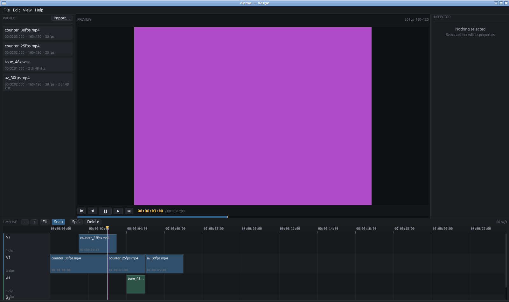

Audio: fades drawn into the waveform, a crossfade between two overlapping clips,
and a track strip with its level, pan and meter.

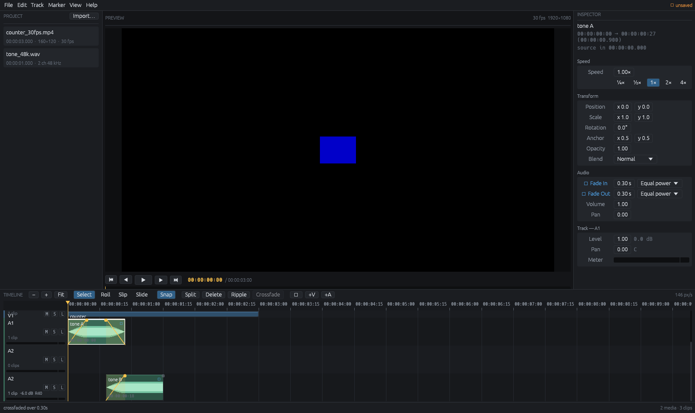

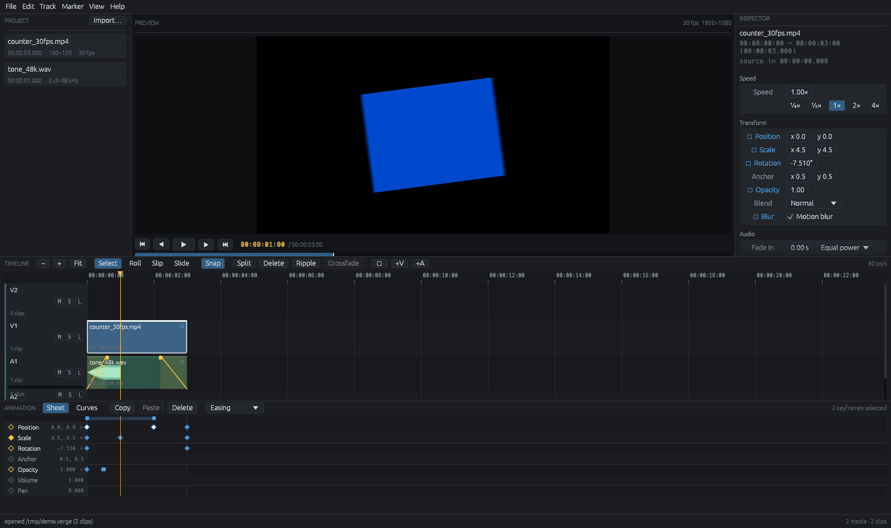

Animation: the selected clip's properties as keyframe rows on the timeline's own
time axis, two keyframes in hand with the bar that scales the span between them,
and the clip itself smeared across the shutter in the preview.

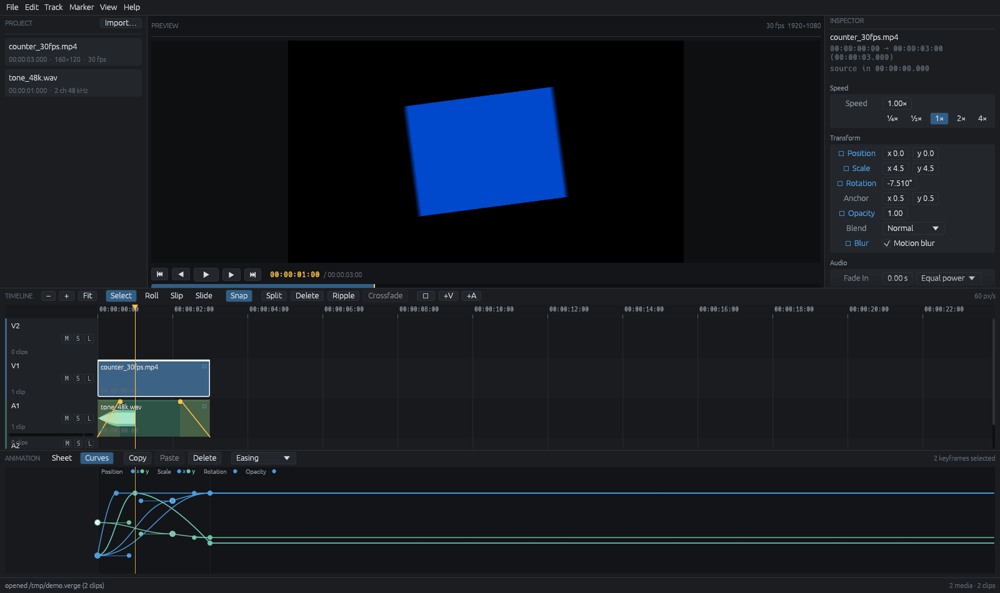

The same keyframes as curves — one per channel, drawn by evaluating the property
rather than by a second opinion about easing, with handles on the selected
points.

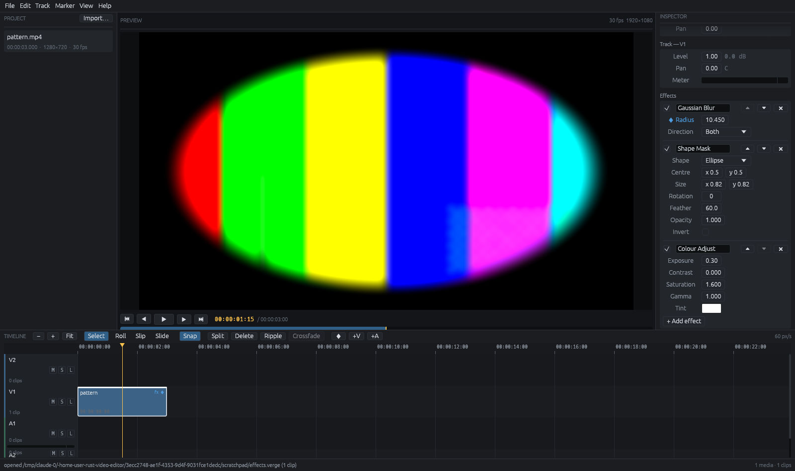

Effects: a blur whose radius is keyframed, a feathered elliptical mask and a
colour adjustment, running in that order on the clip's own picture before it is
laid on the canvas.

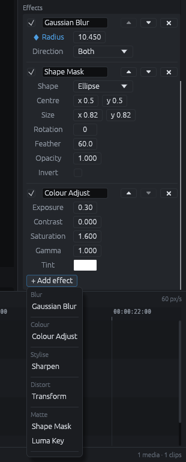

The chain is the pipeline, so the list is the order it runs in and the arrows
change it. Every control is built from what the effect *declares* it takes, so
an effect added later — or by a plugin — arrives with working controls and
keyframes for nothing.

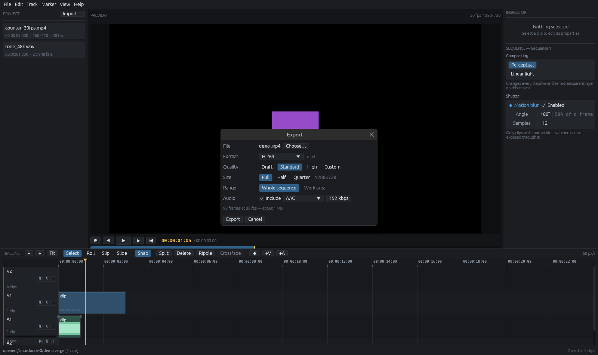

Export: what to write and where, with the file size it will come to. The render
runs on its own thread from a snapshot of the project, so the editor keeps
playing and keeps being edited while it works — and says how far it has got:

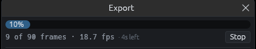

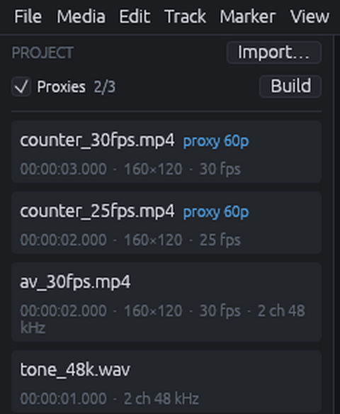

Proxies: two clips have one and the third does not, so the count says 2/3, and
the switch is the single control deciding whether the editor is looking at the
stand-ins or at the real pictures. An export ignores it either way. A badge
reading `proxy?` would mean the file had been built and then deleted — in which
case that clip quietly carries on at full resolution rather than going offline.

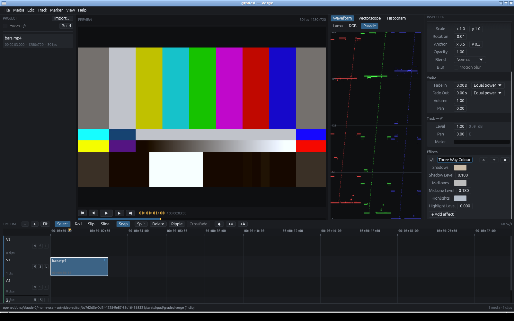

Grading: a three-way corrector in the inspector — a warm swatch on the shadows,
a cool one on the highlights, a level beside each — and the RGB parade reading
the picture that came out. The scopes read the *composited* frame, after the
grade and after every effect, because what is being judged is what will be
delivered rather than an estimate assembled from the parameters that made it.

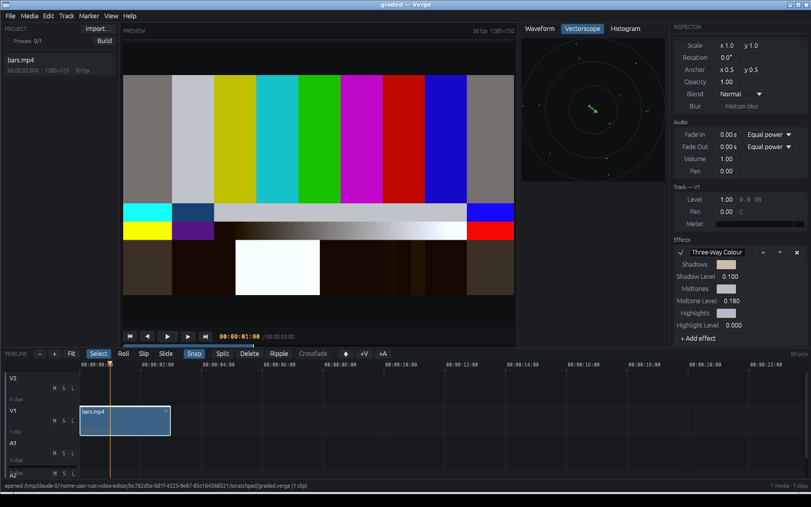

The same shot on the vectorscope: distance from the centre is saturation and
the angle is hue, so the six patches of a colour bar sit as six dots and a cast
shows as the whole plot leaning one way. The rings say how saturated; there are
no primary target boxes, because those are 75% bars under one standard and
drawing them over a Rec. 709 plot would invite a reading they do not support.

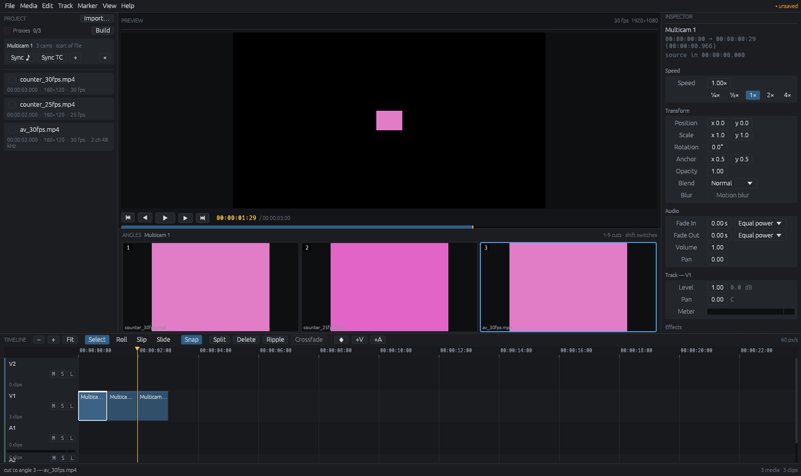

Multicam: three cameras grouped from the media panel, the angle viewer under the
preview with the camera on screen outlined, and a clip cut into three by pressing
2 and then 3. The numbers on the tiles are the controls, so they are assigned
over every angle rather than only the enabled ones — a grid that renumbered
itself mid-shot would move them under your fingers.

The development overlay reports what the frame actually cost, broken down by
stage, so a regression is visible while editing rather than weeks later:

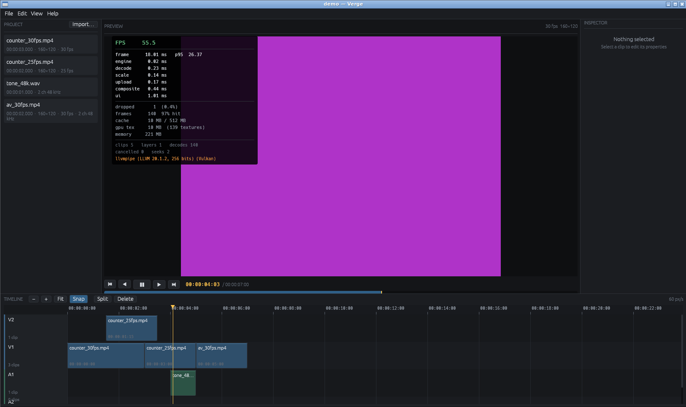

## Downloading

Built archives for Linux, Windows and macOS are attached to every
[release](https://github.com/erasedev1/rust-video-editor/releases), produced by
the workflow in `.github/workflows/release.yml`.

- **Windows** — extract the zip and run `verge.exe`. The FFmpeg DLLs are
  bundled, so there is nothing to install.
- **macOS (Apple silicon)** — `brew install ffmpeg@6`, then extract and run
  `./verge`. There is no Intel build; build from source instead.
- **Linux** — install the FFmpeg 6 runtime libraries, then extract and run
  `./verge`. The exact package names are in the archive's `INSTALL.txt`.

Each archive has a matching entry in `SHA256SUMS`.

To build it yourself instead, read on.

## Building

Everywhere you need three things: a Rust toolchain (**1.95 or newer**), the
**FFmpeg 6 development libraries**, and **libclang** — the FFmpeg bindings are
generated by `bindgen` at build time, which is the step people most often trip
over.

> **FFmpeg 6 specifically.** The `ffmpeg-next` bindings track FFmpeg's major
> version, so the 6.x bindings this project uses will not build against FFmpeg 7
> or later. Most platforms' plain `ffmpeg` package is well past that now, which
> is why each section below names a 6.x package rather than the default one.

Once the prerequisites for your platform are in place:

```sh
cargo run --release
```

Open a project directly with `cargo run --release -- path/to/project.verge`.

### Linux

```sh
# Debian / Ubuntu
sudo apt install build-essential pkg-config clang libclang-dev \
                 libavcodec-dev libavformat-dev libavutil-dev \
                 libswscale-dev libswresample-dev \
                 libasound2-dev libxkbcommon-x11-0
```

`pkg-config` finds FFmpeg for you, so there is nothing to configure.

### macOS

```sh
brew install ffmpeg@6 pkg-config
xcode-select --install   # for the toolchain, if you have not already

# ffmpeg@6 is keg-only, so pkg-config has to be pointed at it.
export PKG_CONFIG_PATH="$(brew --prefix ffmpeg@6)/lib/pkgconfig:$PKG_CONFIG_PATH"
```

Note the `@6`: plain `brew install ffmpeg` installs FFmpeg 9, which the bindings
will not build against. libclang comes with the Xcode command line tools.

### Windows

Use the **MSVC** Rust toolchain (`rustup default stable-msvc`, which is the
default on Windows).

**1. Build tools.** Install [Visual Studio Build Tools][vsbt] and select the
*Desktop development with C++* workload. This provides the linker.

**2. LLVM**, for `bindgen`:

```powershell
winget install LLVM.LLVM
# or: choco install llvm
$env:LIBCLANG_PATH = "C:\Program Files\LLVM\bin"
```

`LIBCLANG_PATH` is the usual cause of a failed first build. Set it permanently
with `setx LIBCLANG_PATH "C:\Program Files\LLVM\bin"` and reopen the shell.

**3. FFmpeg 6.** Download a **shared** build — one with `include\` and `lib\`
directories, which a plain "essentials" build does not have. This is the exact
build the release workflow uses:

```powershell
$url = "https://github.com/GyanD/codexffmpeg/releases/download/6.1.1/ffmpeg-6.1.1-full_build-shared.7z"
Invoke-WebRequest -Uri $url -OutFile ffmpeg.7z
7z x ffmpeg.7z -oC:\
```

Then point the bindings at it:

```powershell
$env:FFMPEG_DIR = "C:\ffmpeg-6.1.1-full_build-shared"   # holds bin\, include\, lib\
$env:PATH += ";$env:FFMPEG_DIR\bin"                    # so the DLLs load at run time
```

The `bin` directory must stay on `PATH` at runtime, not only at build time: a
shared FFmpeg build loads its DLLs when the editor starts. Use `setx` for both
variables to make them permanent.

Do not substitute the vendor's `ffmpeg-release-full-shared.7z`, which always
points at the newest FFmpeg and is long past 6. vcpkg works too if you pin its
`ffmpeg` port to a 6.x version.

**4. Build.**

```powershell
cargo run --release
```

Nothing else is needed: rendering uses Direct3D 12 through `wgpu` and audio
uses WASAPI, both of which ship with Windows.

[vsbt]: https://visualstudio.microsoft.com/downloads/#build-tools-for-visual-studio-2022

### Platform support

The editor is written to be cross-platform and its dependencies resolve for all
three targets, but it has so far only been **built and run on Linux**. macOS and
Windows builds are expected to work and are unverified; if one does not, that is
a bug worth reporting rather than an intended limitation.

Two things are known to be platform-specific in the code today, both isolated
behind interfaces: process memory reporting in `ve-metrics` is implemented for
Linux only and reports "unavailable" elsewhere, and audio output goes through
`cpal`, which has not been exercised on **any** platform: the container this was
developed in has no sound card, so the mixing, metering and ring code is tested
end to end but no test has heard a sample (see
[Architecture](docs/ARCHITECTURE.md#what-is-deliberately-absent)). A machine
without an output device is treated as an ordinary state — the editor opens,
says so in the performance overlay, and keeps cutting.

## Testing

```sh
cargo test --workspace     # 949 tests
cargo bench                # measured, not estimated
```

The rendering tests run against a real GPU device and read pixels back. On a
machine with no GPU they use a software rasteriser rather than being skipped, so
the shader and blend state are always exercised.

Media tests run against committed fixtures in `testdata/`, where each video
frame is a solid colour encoding its own frame index. That lets a test assert
*which* frame a seek returned rather than merely that one came back — which is
how three real decoder bugs were caught.

The export tests encode real files and then decode them again, asserting frame
by frame that what came out is the frame the timeline showed, at the right size,
over the right range, with the sound still in step at 29.97. The proxy tests do
the same in reverse — walking every frame of a built proxy against its original
to prove the two show the same picture at the same instant — and one of them
measures *decode cost* rather than pixels, which is how a seek that had never
worked was found. That is how the
first real export bug was found: packets written without a duration left every
file claiming a frame rate slightly too high, so reading one back landed
between frames — which a test that only checked "a file was written" would
never have noticed.

The grading tests are in two halves, because the two can disagree silently: one
half checks what is *packed* into a pass and the other renders it and reads the
pixels back. A lift moves black and pins white, a gain does the reverse, a gamma
fixes both ends, opposite levels cancel to within 1e-12, a white balance holds
the luma of white, a hue band centred on red selects both magenta and orange,
and a 120° shift turns red into green. The scopes are tested the same way — the
counting against painted frames, the readback against a real device — including
the cases that are easy to get quietly wrong: a half-covered white pixel is
white, a pixel with no coverage is not black, and a neutral frame is one dot
rather than a smudge across four.

## Documentation

- [Architecture](docs/ARCHITECTURE.md) — the design and why it is that way
- [Project format](docs/PROJECT_FORMAT.md) — the `.verge` file
- [Benchmarks](docs/BENCHMARKS.md) — measured performance
- [Roadmap](docs/ROADMAP.md) — where this is going in the future
- [Releasing](docs/RELEASING.md) — how the release builds work

## Layout

| Crate        | Responsibility                                            |
|--------------|-----------------------------------------------------------|
| `ve-time`    | Exact rational time, frame rates, timecode                |
| `ve-core`    | Project, sequence, track, clip, properties, keyframes     |
| `ve-project` | Versioned project file, atomic saves, autosave            |
| `ve-command` | Undoable editing commands                                 |
| `ve-media`   | FFmpeg decoding, frame cache, decode scheduling           |
| `ve-render`  | wgpu compositor                                           |
| `ve-engine`  | Playback clock, composition evaluation, audio mixing      |
| `ve-export`  | Offline rendering, encoding, muxing and proxies           |
| `ve-metrics` | Performance instrumentation                               |
| `ve-app`     | The editor shell                                          |

Dependencies point one way: `ve-app` knows about everything, `ve-time` knows
about nothing.

## Licence

MIT or Apache-2.0, at your option.
